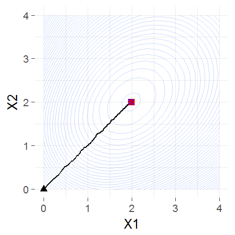
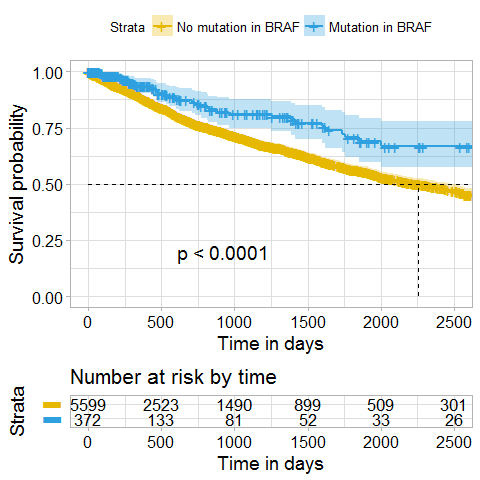
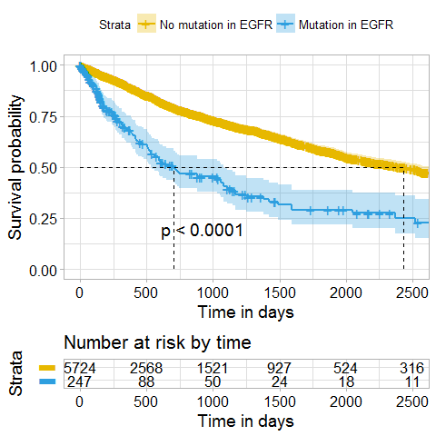

coxphSGD
================

[](http://cran.r-project.org/web/packages/coxphSGD) [](http://cranlogs.r-pkg.org/badges/grand-total/coxphSGD) [](https://travis-ci.org/MarcinKosinski/coxphSGD)

-   [Overview](#overview)
    -   [Applications](#applications)
    -   [Installation](#installation)
    -   [Assumptions](#assumptions)
-   [Simple example](#simple-example)
    -   [Simulated data](#simulated-data)
    -   [Fit the model](#fit-the-model)
    -   [Track estimates during each iteration on the contour lines plot](#track-estimates-during-each-iteration-on-the-contour-lines-plot)
    -   [Used code](#used-code)
-   [Genomic data analysis](#genomic-data-analysis)
    -   [The Cancer Genome Atlas Data and RTCGA](#the-cancer-genome-atlas-and-rtcga)
    -   [Fit the complex model](#fit-the-complex-model)
    -   [Estimated survival curves](#estimated-survival-curves)
-   [Mathematical formulas](#mathematical-formulas)
-   [useR 2017](#user-2017)
    -   [Long abstract](https://github.com/MarcinKosinski/useR2017/blob/master/abstract_MarcinKosinski.pdf)
    -   [Short abstract](https://github.com/MarcinKosinski/useR2017/blob/master/abstract_MarcinKosinski_short.pdf)
    -   [Presentation](https://r-addict.com/useR2017/)

Overview
========

Applications
------------

Know the `survival::coxph()` function that calculates the estimates of the Cox Proportional Hazards model? <br> It uses the **gradient descent order II** method (known also as Newton-Raphson method) to optimize the **partial** log-likelihood function of the Cox PH model.

The `coxphSGD::coxphSGD()` is an equivalent that uses the **stochastic gradient descent order I** method in the optimization process, which can be beneficial in situations like

-   the data is in a **streaming structure** and appear in batches
-   the data is of the great volume (computations and RAM issues) and one can't simply use all data for computations and needs to go **block by block** of the data

> The stochastic gradient descent order I method can be used with already calculated estimates to generate updated ones in the situation in which new data appear and one can't recalculate the whole model with all historical data.

Installation
------------

``` r
install.packages('coxphSGD') # once it is on CRAN
devtools::install_github('MarcinKosinski/coxphSGD') # development version
```

Usage.

``` r
library(coxphSGD)
## help(package = 'coxphSGD') # manual reference
```

Assumptions
-----------

The Cox Proportional Hazards model assumes (mainly) that the explanatory variables are constant over time and that the **hazard** (one of the survival measures) estimates between considered groups are proportional over the time.

This model calculates the estimates that can be interpreted as proportion of the hazard change while moving from one level of the considered explanatory variable to another (while all other variables are fixed) - explained with details in the [Mathematical formulas](#mathematical-formulas) section.

Simple example
==============

Simulated data
--------------

Let's simulate artificial/fake data that follows the Cox Proportional Hazards model assumptions. Such data can be simulated from the Weibull distribution of the survival times (times during which the patient/item is under observation till **the event or censoring**) with some exponentially distributed conditions on the occurance of the censoring.

The approach was taken from the StackOverflow question [How to create a toy survival (time to event) data with right censoring](https://stats.stackexchange.com/questions/135124/how-to-create-a-toy-survival-time-to-event-data-with-right-censoring) and is based on [Generating survival times to simulate Cox proportional hazards models](http://onlinelibrary.wiley.com/doi/10.1002/sim.2059/abstract)

``` r
library(survival)
set.seed(456)
x <- matrix(sample(0:1, size = 20000, replace = TRUE), ncol = 2)
head(x)
```

         [,1] [,2]
    [1,]    0    0
    [2,]    0    1
    [3,]    1    0
    [4,]    1    0
    [5,]    1    1
    [6,]    0    0

``` r
dCox <- dataCox(10^4, lambda = 3, rho = 2, x,
                beta = c(2,2), cens.rate = 5)
head(dCox)
```

      id       time status x.1 x.2
    1  1 0.04408843      0   0   0
    2  2 0.04919427      0   0   1
    3  3 0.17103077      0   1   0
    4  4 0.07568921      1   1   0
    5  5 0.05604885      1   1   1
    6  6 0.07529861      1   0   0

Fit the model
-------------

One can fit the model with the `coxphSGD()` function. Below is the explanation of parameters:

-   `formula` - the `formula` object passed in the same way you would with the `coxph` function
-   `data` - the list of data.frame's (containing the same columns) corresponding to batches of data
-   `epsilon` - the convergence parameter - optimization will stop when the difference of the estimates in subsequent steps will be smaller than epsilon (euclidean distance)
-   `learn.rates` - the function to be used to determine the step length in subsequent steps of the optimization process
-   `beta.zero` - vector containing start points for the optimization process
-   `max.iter` - the maximal number of algorithm iterations, when the iterations number exceeds the batches number then the data are used again (one full data usage / all batches usage is called an epoch)

``` r
batch_id <- sample(1:90, size = 10^4, replace = TRUE)
dCox_split <- split(dCox, batch_id)
results <-
  coxphSGD(formula     = Surv(time, status) ~ x.1+x.2,
           data        = dCox_split,
           epsilon     = 1e-5,
           learn.rates = function(x){1/(100*sqrt(x))},
           beta.zero   = c(0,0),
           max.iter    = 10*90)
```

Track estimates during each iteration on the contour lines plot
---------------------------------------------------------------

One can extract the estimaes of the Cox PH model for each of the iteration with the following code.

``` r
coeff_by_iteration <-
  as.data.frame(
    do.call(
      rbind,
      results$coefficients
      )
    )
head(coeff_by_iteration)
```

            x.1       x.2
    1 0.0000000 0.0000000
    2 0.1287670 0.1505911
    3 0.2077041 0.2279745
    4 0.2815383 0.2849962
    5 0.3466851 0.3416297
    6 0.3864788 0.4102790

Then having the estimates in each iteration of the optimization process, one can create a plot of the contour lines of the partial log-likelihood calculated on the full data to compare the paths of optimization process with the usage of **stochastic gradient descent order I** method to get the final Cox PH model estimates.

Here with a black triangle the original `beta.zero` (set to iteration 0) are marked and with a red square the point that was estimated by SGD I algorithm and with blue crossed dot the estimates calculated by the GD II (Newton-Raphson algorithm).



### Used code

The code to reproduce the graph can be found in [this gist](https://gist.github.com/MarcinKosinski/909826b62f8849675f0980384fd6e28e).

Genomic data analysis
=====================

The Cancer Genome Atlas and RTCGA
---------------------------------

[The Cancer Genome Atlas](https://cancergenome.nih.gov/) data included in the [RTCGA](https://github.com/RTCGA/) family of R packages

> The Cancer Genome Atlas (TCGA) is a comprehensive and coordinated effort to accelerate our understanding of the molecular basis of cancer through the application of genome analysis technologies, including large-scale genome sequencing - <http://cancergenome.nih.gov/>.


I have converted selected datasets from this study into a few separate packages that are hosted on Bioconductor. These R packages make selected datasets easier to access and manage. Datasets in **RTCGA** data packages are large and cover complex relations between clinical outcomes and genetic background.

Fit the complex model
---------------------

### Data overview

In the real life genetic problems for the algorithm application we will use the clinical outcomes (times and death status) for patients suffering from Breast Cancer and the information about genes that were mutated in the cancer tissue collected from the patient.

Data were processed during my master thesis and are stored in the [archivist](https://github.com/pbiecek/archivist) like repository and can be loaded with the following command

``` r
library(archivist)
testCox <- archivist::aread('MarcinKosinski/MasterThesis/3eebc99bd231b16a3ea4dbeec9ab5edb')
trainCox<- archivist::aread('MarcinKosinski/MasterThesis/1a06bef4a60a237bb65ca3e2f3f23515')
class(trainCox)
```

    [1] "list"

``` r
length(trainCox)
```

    [1] 98

``` r
head(
  trainCox[[1]][ # train data is a list of data frames that corresponds to batches
    c(7, 10),    # pick few rows
    c(210,302,356,898,911,1092:1093) # pick few columns, and survival outcomes
    ]
  )
```

         COL14A1 DOCK9 FASN SEMA5A SHPRH patient.vital_status times
    793        0     0    0      0     0                    0   268
    1068       1     0    0      1     0                    1  1171

### Actual fit

``` r
formulaSGD <- archivist::aread('MarcinKosinski/MasterThesis/064277e1c2a1fbea36d7d0ac518b9c8d')
# Surv(times, patient.vital_status ~ all posible genes
# how many genes are there in the whole formula?
length(
  strsplit(
    as.character(formulaSGD)[3],
    split = "+",
    fixed = T
  )[[1]]
)
```

    [1] 1091

One can evalute the code to fit the model or can download the already calculated model

``` r
coxphSGD(
  formula = formulaSGD,
  data = trainCox,
  learn.rates = function(x){1/x},
  max.iter = 490 # 98*5 / 5 full epoches
) -> model
```

``` r
model <- archivist::aread('MarcinKosinski/MasterThesis/446ac4dcb7d65bf39057bb341b296f1a')
```

### Coefficients/insights

Please find the top 20 absolute values of the coefficients from the model with the names of genes mutations they correspond to.

|          |    beta|  exp\_beta|
|----------|-------:|----------:|
| EGFR     |   0.977|      2.657|
| ATP2B2   |   0.723|      2.061|
| TP53     |   0.708|      2.030|
| NDST4    |   0.702|      2.018|
| CHRM2    |   0.642|      1.901|
| LRRC4C   |   0.624|      1.866|
| CDKN2A   |   0.615|      1.850|
| C3       |   0.594|      1.811|
| GLI2     |   0.593|      1.809|
| KIAA1409 |   0.575|      1.777|
| KEAP1    |   0.566|      1.762|
| Unknown  |   0.554|      1.741|
| TMEM132D |   0.537|      1.710|
| DNAH17   |  -0.540|      0.583|
| DLGAP2   |  -0.544|      0.580|
| BCORL1   |  -0.545|      0.580|
| PLXNC1   |  -0.570|      0.566|
| CDH1     |  -0.587|      0.556|
| FLRT2    |  -0.883|      0.413|
| BRAF     |  -0.954|      0.385|

Estimated survival curves
-------------------------

One could see, from the previous table that the `BRAF` gene if mutated has the negative impact on the hazard ratio (hazard is decreased 0.385 times), which means that people with that mutation will live longer. In the same time the `EGFR` gene mutation has a positive impact on the hazard ratio (hazard is increased 2.657 times) so that people with that gene mutation has a high death rate and short survival times.

Let's see how the results of the Cox Proportional Hazards model where coefficients where estimated with the Stochastic Gradient Descent order I method corresponds to the trends in data. One visual way of testing the output is creating Kaplan-Meier estimates of survival curves for groups that corresponds to those genes mutations.

``` r
library(survminer)
fit_braf <- survfit(
  Surv(times, patient.vital_status) ~ BRAF,
  data = do.call(rbind, trainCox)
)
ggsurvplot(
  fit_braf,
  palette = c("#E7B800", "#2E9FDF"),
  surv.median.line = "hv",  # add the median survival pointer.
  legend.labs =             # change legend labels.
    c("No mutation in BRAF", "Mutation in BRAF"),    
  risk.table = TRUE,       # show risk table.
   pval = TRUE,             # show p-value of log-rank test.
   conf.int = TRUE,         # show confidence intervals for 
                            # point estimates of survival curves.
   xlim = c(0,2500),         # present narrower X axis, but not affect
                            # survival estimates.
   xlab = "Time in days",   # customize X axis label.
   break.time.by = 500,     # break X axis in time intervals by 500.
   ggtheme = theme_light(), # customize plot and risk table with a theme.
 risk.table.y.text.col = T, # colour risk table text annotations.
  risk.table.y.text = FALSE # show bars instead of names in text annotations
                            # in legend of risk table
)
```



``` r
fit_egfr <- survfit(
  Surv(times, patient.vital_status) ~ EGFR,
  data = do.call(rbind, trainCox)
)
ggsurvplot(
  fit_egfr,
  palette = c("#E7B800", "#2E9FDF"),
  surv.median.line = "hv",  # add the median survival pointer.
  legend.labs =             # change legend labels.
    c("No mutation in EGFR", "Mutation in EGFR"),
  risk.table = TRUE,       # show risk table.
   pval = TRUE,             # show p-value of log-rank test.
   conf.int = TRUE,         # show confidence intervals for 
                            # point estimates of survival curves.
   xlim = c(0,2500),         # present narrower X axis, but not affect
                            # survival estimates.
   xlab = "Time in days",   # customize X axis label.
   break.time.by = 500,     # break X axis in time intervals by 500.
   ggtheme = theme_light(), # customize plot and risk table with a theme.
 risk.table.y.text.col = T, # colour risk table text annotations.
  risk.table.y.text = FALSE # show bars instead of names in text annotations
                            # in legend of risk table
)
```



The code used for the whole analysis can be found [in this gist](https://gist.github.com/MarcinKosinski/bf8924c2ac1da613af675e66c6a12545)

Mathematical formulas
=====================

Cox model specification
-----------------------

Cox model assumes that the hazard function is of the form (for *i*th obserwation / *X*<sub>*i*</sub>)
*λ*<sub>*i*</sub>(*t*)=*λ*<sub>0</sub>(*t*)*e*<sup>*X*<sub>*i*</sub>(*t*)′*β*</sup>
, where *λ*<sub>0</sub> is not specified nonnegative base hazard function and *β* is a vector of coefficients.

Cox model, for variables constat over time, is called **the model of proportional hazards**, due to the fact that proportion of hazards for two observations *X*<sub>*i*</sub> and *X*<sub>*j*</sub> is constant over the time:
$$\\dfrac{\\lambda\_i(t)}{\\lambda\_j(t)} = \\dfrac{\\lambda\_0(t)e^{X\_i\\beta}}{\\lambda\_0(t)e^{X\_j\\beta}} = \\dfrac{e^{X\_i\\beta}}{e^{X\_j\\beta}} = e^{(X\_i-X\_j)\\beta}.$$

Cox model assumptions
---------------------

-   Coefficients of the model *β*<sub>*k*</sub>, *k* = 1, ⋯, *p* are constant over the time. <br>
-   Functional form of independent variable effect - the form of the model *λ*<sub>*i*</sub>(*t*)=*λ*<sub>0</sub>(*t*)*e*<sup>*X*<sub>*i*</sub>(*t*)′*β*</sup>. <br>
-   Observations are independent. <br>
-   The censoring of event is non-informative. <br>
-   The censoring is independent (of the mechanism of events). <br>

Cox model (partial) log-likelihood function
-------------------------------------------

$$\\dfrac{e^{X\_i'\\beta}}{\\sum\\limits\_{l\\in \\mathscr{R}(t\_i)}^{}e^{X\_l'\\beta}}$$

The full log-likelihood

*L*(*β*, *φ*)=<sub>*p*</sub>*L*(*β*)⋅*L*<sup>\*</sup>(*β*, *φ*)

The partial log-likelihood

$${}\_{p}L(\\beta) = \\prod\\limits\_{i=1}^{K}\\dfrac{e^{X\_i'\\beta}}{\\sum\\limits\_{l=1}^{n}Y\_l(t\_i)e^{X\_l'\\beta}}$$

The Newton-Raphson method of optimization
-----------------------------------------

Newtona-Raphsona - the regular method in `coxph` function <br> Minimization of the *Q*(*w*) function <br>

Start with a start solution, e.g. *w*<sub>0</sub> = 0. Then for *k* = 1, 2, … till convergence

-   Calculate gradient in the point *w*<sub>*k* − 1</sub>, ∇<sub>*Q*</sub>(*w*<sub>*k* − 1</sub>) and the inverse of hesian (*D*<sub>*Q*</sub><sup>2</sup>(*w*<sub>*k* − 1</sub>))<sup>−1</sup>.
-   Do a step in the direction og the negative gradient with the distance of the step corresponding to the Hesian
    *w*<sub>*k*</sub> = *w*<sub>*k* − 1</sub> − (*D*<sub>*Q*</sub><sup>2</sup>(*w*<sub>*k* − 1</sub>))<sup>−1</sup>∇<sub>*Q*</sub>(*w*<sub>*k* − 1</sub>)

The Stochastic Gradient Descent (order I) method of optimization
----------------------------------------------------------------

Stochastic Gradient Descent - the regular method in `coxphSGD` function <br> Minimization of the *Q*(*w*) function <br>

Start with a start solution, e.g. *w*<sub>0</sub> = 0. Then for *k* = 1, 2, … till convergence

-   Sample *i* ∈ {1, …, *n*} (one point or more).
-   Calculate the gradient *Q*<sub>*i*</sub> (for corrsponding observations) in the point *w*<sub>*k* − 1</sub>, ∇<sub>*Q*<sub>*i*</sub></sub>(*w*<sub>*k* − 1</sub>).
-   Do a step in the direction og the negative gradient
    *w*<sub>*k*</sub> = *w*<sub>*k* − 1</sub> − *α*<sub>*k*</sub>∇<sub>*Q*<sub>*i*</sub></sub>(*w*<sub>*k* − 1</sub>)

where the step *α*<sub>*k*</sub> is given by a user.

Remarks for the analysis
------------------------

-   Model can be used for **streaming** data or data stored in **blocks**
-   We did not checked the assumptions of the Cox PH model during the analysis.
-   We didn't provide any diagnostic of residuals after the analysis.
-   There is no clear way on how could one choose the distances of learning rates.
-   No solution (yet) for stratified models.
-   No solution (yet) for models where patients (could) have more than 1 event (of the same or various types).

useR 2017
=========

-   [Long abstract](https://github.com/MarcinKosinski/useR2017/blob/master/abstract_MarcinKosinski.pdf)
-   [Short abstract](https://github.com/MarcinKosinski/useR2017/blob/master/abstract_MarcinKosinski_short.pdf)
-   [Presentation](https://r-addict.com/useR2017/)
